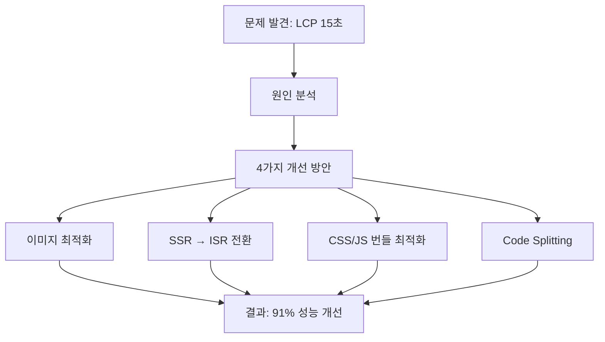

[https://www.solid-connection.com/](https://www.solid-connection.com/)


## 더 빠르게 -더 가볍게 


저는 종종 페이지를 들어가면 너무 느린페이지를 마주치면 다시 뒤로 돌아가곤합니다 .


빠른 페이지가 이탈률은 줄여주지 않지만 느린페이지는 이탈률을 줄일 수 있다고 생각합니다 


저희 프로젝트는 이러한 이슈를 겪고 있었습니다. 


---


- 솔커 페이지가 시작된지 1년이 넘은 지금 …..

# 1. 문제 정의 및 현황 분석


---


# **🔍 왜 우리 홈페이지는 사람들이 들어오고도 나갈까?**


솔커(Solid-Connection) 메인 페이지는 트래픽이 많습니다.


그런데, 이상하리만치 **이탈률도 높았습니다.**


Google Analytics를 통해 지난 1년간 데이터를 분석해보니,

- 전체 조회수 중 27%가 메인 페이지에 집중되고,
- 활성 사용자 중 **63%가 메인 페이지에서 활동**하고 있었지만,
- **이탈률은 21%로 가장 높았습니다.**
> 유입은 많은데 왜 머무르지 않을까?

여러이유가 있을것 같습니다 


허나 매번 자주 접속하면서 페이지를 확인하는데 새로운 디바이스로 연결시 이상하리만큼 느린 현상이 발생했습니다 

> “어… 왜 이렇게 느리지?”

그 질문에서 시작된 게 이번 성능 개선 작업이었습니다.


여러 수치를 통해 페이지 속도를 확인했습니다 


# 2. 성능 측정 

- 1. light house

    


### LCP가 15초 …? 


fcp는 양호했어도 LCP 15초면 성능이 낮은 상태에서는 15초이상 렌더링이 소요된다는 것이었습니다 … 


믿지 못할 결과를 받은 뒤 webpagetest 사이트를 통해서 검증을 한번 더하기로 했습니다 


## 2. [webpagetest.org](https://webpagetest.org/)


- 해당 테스트를 진행한 결과 충격적인 결과를 받았습니다
- 아래의 결과를 보고 페이지 개선을 해야겠다는 생각이 확신이 되었습니다 .
> 느린 LCP, 비직관적인 CTA, 무거운 이미지…   
> 이 모든 것들이 “나갈 이유”가 되어주고 있었죠.  
> 그래서 “우리 페이지는 더 이상 느리지 않습니다. 나가실 필요 없어요!”를 보여주기 위해  
> LCP 최적화와 사용자 행동 흐름 분석을 바탕으로 한 개선 프로젝트를 시작했습니다.
> 런타임 3번중 2번은 time out…. 
>
> 
>
>

---


# 3. 홈 페이지 구조 분석 

- 홈페이지는 3번의 fetch로 이루어진 페이지입니다
1. 인기있는 학교 리스트

    

2. 전체 학교 리스트

    

3. 교환학생 관련 영상 및 썸네일

    


1번과 2번은 백엔드 서버로부터 받아오며 3번은 firebase 연결을 통해 가져오는 데이터입니다. 


---


### 일반적인 뷰포트


모바일 웹뷰 형식의 웹 성격상 세로가 길다는것을 감안하더라도 3번인 교환학생 관련 영상 및 썸네일은 항상 뷰포트에 들어오는 요소가 아니었습니다. 


따라서 뷰포트에 포함되는 요소만 가장 먼저 렌더링 해주고 나머지는 dynamic 하게 로드하는것을 첫번째 목표로 잡았습니다. 


---


# 4. 원인 분석

- light house 및 webpagetest 플랫폼 모두 동일한 경고 메시지가 반복적으로 표시되었습니다
- 이미지 요소의 페인트가 오래걸린다는 말입니다..

    

- 이해할수 없는 내용이었습니다 이미지 하나때문에 11초가 걸린다면 다른 플랫폼들 특히나 웹툰 서비스 같은 부분들은 렌더링 하는데 엄청난 시간이 소요되어야 합니다 그럼에도 빠르게 되었던 이유는 무엇일까

→ 해당 의문을 통해 개선이 시작되었습니다 . 


---


# 5. 4가지 해결 방안

- 아래와 같이 4가지 방안으로 해결을 시도했습니다

# 5 - 1. 이미지 개선


## 웹툰 서비스분석 

- 이전에 모바일 3g환경에서 웹툰을 보다면 스크롤을 너무 빠르게 내리는경우 이미지가 로드되지 않는경우가 존재했습니다
- 이제는 우리 모두 보기만 해도 이해할것 같습니다
- lazy하게 받아오고, observer로 감지해서 처리하는 방식이었습니다

### 또한 또다른 웹툰 서비스와 저희 플랫폼의 차이를 발견했습니다 


| 200OK | png | (index):0Parser | 8,654 kB8,654 kB | 6.18 s166 ms |
| ----- | --- | --------------- | ---------------- | ------------ |


firebase를 통해 가져오는 뉴스 섹션 이미지는 png 포맷이었고, 무려 8654KB였습니다.


5g 환경에서 이미지를 직접 클릭해서 로드하는데에만 시간이 거의 4초가 걸렸습니다 


그러면 웹툰 서비스는 이미지를 어떻게 개선할까 ? 


 **- 이미지 최적화 – JPEG → AVIF**

- JPEG 이미지를 AVIF 포맷으로 변환하면 **최대 60% 용량 절감**
- WebP도 효과적이지만 AVIF가 더 높은 압축률을 보임 (화질은 비슷하거나 더 좋음)
- 브라우저가 지원한다면 Next.js에서는 자동 변환 지원 가능

위 처럼 Next js 에서 활용하는 AVIF 기능을 적극적으로 사용하기로 결심했습니다 


| **포맷**   | **파일 크기**          | **화질**     | **지원 브라우저**                       |
| -------- | ------------------ | ---------- | --------------------------------- |
| **JPEG** | 보통                 | 보통         | 전 브라우저                            |
| **WebP** | JPEG 대비 약 25~30% ↓ | 비슷         | 대부분 지원                            |
| **AVIF** | JPEG 대비 최대 60% ↓   | 비슷 또는 더 나음 | 최신 브라우저 (Chrome, Firefox, Edge 등) |


next.config.mjs 파일을 살펴보았습니다 


```javascript
images: {
    unoptimized: true,
    domains: [
			~~~~
    ],
  },
```


unoptimized 값이 true로 설정되어있었습니다 


우리는 버셀을 구독했기에! 최적화를 사용하기로 결정했습니다. 


```javascript
images: {
    // unoptimized: true,
    domains: [
    ~~
    ],
    formats: ["image/avif", "image/webp"],
  },
```

- 위 처럼 avif 값또는 webp로 자동으로 변환해서 가져오도록 했습니다

---


# 5 - 2. SSR 개선 


| **항목**    | **SSR (Server-Side Rendering)** | **CSR (Client-Side Rendering)** | **ISR (Incremental Static Regeneration)** |
| --------- | ------------------------------- | ------------------------------- | ----------------------------------------- |
| 초기 속도     | 보통 (서버 연산 필요)                   | 느림 (모두 JS로 로딩)                  | 빠름 (정적 파일로 제공)                            |
| 사용자별 데이터  | O (동적 처리 가능)                    | O                               | X (캐시 기반)                                 |
| SEO 친화성   | 매우 높음                           | 낮음                              | 높음                                        |
| 페이지 변경 빈도 | 자주 변경됨                          | 자주 변경됨                          | **거의 변하지 않음**                             |
| 사용 예시     | 로그인 필요 페이지                      | 대시보드 등 실시간성 페이지                 | 홈, 소개 페이지 등                               |

- 기존의 레거시 코드들은 next임에도 불구하고 ssr이 아닌 csr이 대부분이었습니다
- 홈페이지 같은경우에는 자주 바뀌지 않기에 static하게 만들면 너무나도 좋아보였습니다
- 허나 여기서 백엔드의 구현사항 반영이 필요했습니다
- 전체 학교 리스트의 전체 탭 클릭시
    - 로그인시에는 해당 유저의 정보 기반으로 추천
    - 비로그인시에는 모두 같은 데이터 전달

        

> → 로그인 여부에 따라 데이터를 다르게 보여줘야 하니 SSR이 어려운 구조였습니다.  
> 아마 이 때문에 기존에는 CSR로 구현한 것으로 보입니다.

기존에도 그래서 csr로 만든것으로 보여집니다 


허나 한개의 컴포넌트 때문에 SSR의 장점을 못살린다면 너무나도 손해기 때문에 이를 반영하는 방법을 고안했습니다 


fetch는 부모에서 하고 리액트 쿼리를 통해 캐싱하고 enable값에 isLogin을 넣어서 관리해보자 


```typescript
const UniversityList = ({ allRegionsUniversityList }: UniversityListProps) => {
  // 로그인 시에는 추천 대학 정보를 가져오고, 비로그인 시에는 isr로 가져온 데이터를 사용합니다
  const isLogin = isAuthenticated();
  const { data, error } = useGetRecommendedUniversity(isLogin);
  const clientFetchedRecommendedUniversities = data?.recommendedUniversities || [];

  const { region, handleRegionChange } = useRegionHandler();
  const choices = Object.values(RegionEnumExtend);
  // 권역별 전체 리스트
  // 로그인 상태에 따라 추천 대학 리스트를 가져오거나, 권역별 리스트를 사용합니다
  const universities: ListUniversity[] =
    isLogin && !error ? clientFetchedRecommendedUniversities : region ? (allRegionsUniversityList[region] ?? []) : [];
```


해당 방법을 통해서 fetch도 정적으로 진행하고 로그인 상태인경우에만 fetch를 한번 진행하고 리액트 쿼리를 통해 캐싱하도록 했습니다 

- 또한 본래 SSR 로 작동하던 페이지를 정적인 페이지 ISR로 수정했습니다

매번 새로운 데이터가 필요없는 홈페이지 특성을 고려해서 정적 페이지로 1일마다 새로 만들어지도록 설정했습니다 


그 결과 FCP가 크게 상승했습니다 

> PS….. 분명히 ISR로 수정했는데 빨라지지 않는 FCP …   
> 서버 요청을 통합 관리하기 위해 만든 serverFetch 내부에서 쿠키를 사용하는 바람에, 정적으로 생성될 수 있는 페이지가 SSR로 강제되었던 것이 원인이었습니다.
>
> 
>
>
> 해당 waterfall을 유심히 보면서 테스트 하지 않았다면 인지 못했을 내용이었습니다 … 
>
>
> 왜 더 느려질까 싶었는데…
>
>
> 매번 FCP가 낮고 초기 html 로드하는 속도가 너무 느리다고 생각했었는데 이를 위해 서버컴폰너트를 덜어내는 수고 등을 했었는데 결국은 cookies 를 사용하는 코드 때문이었다는 … 😅
>
>

---


# 5 - 3. CSS 개선 , js 번들 크기 축소 

- critical css는 인라인으로 작성하고 레거시 css 및 글로벌 css 모두 간소화 진행했습니다
- 기존 레거시 모듈css 등과 테일윈드가 섞여있어서 css가 렌더링을 오래 차단하는 형태였습니다
- 사용하지 않는 레거시 컴포넌트 및 반복되는 요소들 삭제 진행했습니다


---


# 5 - 4. code 스플리팅 적용 


이제 대부분의 요소는 개선 되었습니다 


허나 문제는 이미지 요소가 가장큰 LCP 주범이었는데 이미지를 모두 불러온다는것입니다. 


특히 뉴스 섹션의 이미지는 너무 무거웠고 이 이미지들이 lazy하게 로딩되어서 화면이 자주 흔들려 CLS값도 매우 낮아졌습니다 


따라서 뷰포트 외부에 있는 이미지를 늦게 불러오도록 설정하는것이 중요했습니다 


### 1. 인기있는 학교 섹션의 이미지 

- 해당 부분의 이미지는 무조건 3개는 보이고 가로가 긴 요소에 따라 최대 4개까지 보일 수있습니다
- 따라서 LCP 후보를 직접 선정하고 그외 요소들은 LCP 후보에서 제외하도록 코드 스플리팅을 적용했습니다

    ```typescript
    const PopularUniversitySection = ({ universities }: PopularUniversitySectionProps) => {
      const aboveFold = universities.slice(0, 3);
      const belowFold = universities.slice(3);
    
      return (
        <div className="overflow-x-auto">
          <div className="flex gap-2">
            {/* 첫 3장은 즉시 전송 – LCP 후보 */}
            {aboveFold.map((university, index) => (
              <PopularUniversityCard
                priority={index === 0} // 첫 번째만 priority
                loading="eager" // 즉시 로딩
                fetchPriority="high" // 높은 우선순위
                quality={index === 0 ? 60 : 55} // LCP는 60, 나머지는 55로 최적화
                key={university.id}
                university={university}
              />
            ))}
    
            {/* 나머지는 동적 렌더링으로 위임 */}
            {belowFold.map((university) => (
              <Suspense
                key={university.id}
                fallback={
                  <div className="relative w-[153px]">
                    <div className="h-[120px] w-[153px] animate-pulse rounded-lg bg-gray-200" />
                  </div>
                }
              >
                <PopularUniversityCardDynamic
                  university={university}
                  priority={false}
                  loading="lazy"
                  fetchPriority="low"
                  quality={50} // 동적 로딩 이미지는 50으로 최대 압축
                />
              </Suspense>
            ))}
          </div>
        </div>
      );
    };
    // PopularUniversityCard를 동적 임포트
    const PopularUniversityCardDynamic = dynamic(() => import("./_ui/PopularUniversityCard"), {
      ssr: false,
      loading: () => (
        <div className="relative w-[153px]">
          <div className="h-[120px] w-[153px] animate-pulse rounded-lg bg-gray-200" />
        </div>
      ),
    });
    ```

> 개선전에는 LCP 요소에 모든 이미지가 포함 
>
> 
>
>
> 개선후에는 LCP 요소에 이미지가 미포함 
>
> 
>
>

### 2. 뉴스 섹션 

- 해당 섹션은 아예 뷰포트에 잡힐 가능성이 없습니다 허나 이미지를 초기에 불러오기에 로드 속도에 큰 영향을 끼쳤습니다
- 코드 스플리팅을 적용해서 초기 번들에서 제외시키고
- 해당 컴포넌트 자체를 observe를 통해서 렌더링을 제한했습니다

```typescript
"use client";

import Image from "next/image";
import { useEffect, useRef, useState } from "react";

import { News } from "@/types/news";

import { IconSpeaker } from "@/public/svgs";

export type NewsSectionProps = {
  newsList: News[];
};

const NewsSection = ({ newsList }: NewsSectionProps) => {

// 커스텀 훅으로 이후 제외 
  const [visible, setVisible] = useState(false);
  const sectionRef = useRef<HTMLDivElement | null>(null);
  useEffect(() => {
    if (!sectionRef.current) return;

    const observer = new window.IntersectionObserver(
      ([entry]) => {
        if (entry.isIntersecting) {
          setVisible(true);
          observer.disconnect();
        }
      },
      {
        rootMargin: "0px",
        threshold: 0,
      },
    );

    observer.observe(sectionRef.current);

    return () => observer.disconnect();
  }, []);

  return (
    <div ref={sectionRef} className="mt-6 pl-5">
      <div className="mb-2.5 flex items-center gap-1.5 font-serif text-base font-semibold text-k-700">
        솔커에서 맛보는 소식
        <IconSpeaker />
      </div>
      {!visible ? (
        <div className="flex flex-col gap-4">
          {Array.from({ length: 3 }).map((_, idx) => (
            <div key={idx} className="flex animate-pulse gap-4">
              <div className="h-24 w-44 shrink-0 rounded-xl bg-gray-300" />
              <div className="mr-5 flex flex-col gap-2">
                <div className="h-5 w-32 rounded bg-gray-300" />
                <div className="h-4 w-40 rounded bg-gray-200" />
              </div>
            </div>
          ))}
        </div>
      ) : (
        <div className="flex flex-col gap-4">
          {newsList.map((news) => (
            <a key={news.id} target="_blank" href={news.url} rel="noreferrer">
              <div className="flex gap-4">
                <Image
                  loading="lazy"
                  className="h-24 w-44 shrink-0 rounded-xl object-cover"
                  src={news.imageUrl}
                  alt={news.title}
                  width={170}
                  height={90}
                />
                <div className="mr-5 flex flex-col gap-0.5">
                  <div className="text-serif text-sm font-semibold leading-normal text-k-700">{news.title}</div>
                  <div className="font-serif text-xs font-normal leading-normal text-k-500">{news.description}</div>
                </div>
              </div>
            </a>
          ))}
        </div>
      )}
    </div>
  );
};
```


### **✂️ Code Splitting 효과**


**Before**

- 모든 이미지와 컴포넌트가 한 번에 로딩했습니다
- LCP 요소에 포함될 이미지가 너무 많았고 CLS도 불안정했습니다

**After**

- **Skeleton UI + IntersectionObserver** 기반으로 **화면 안에 들어오기 전까지는 로딩하지 않습니다**
- 주요 이미지(.slice(0,3))만 eager, 나머지는 lazy 처리

→ 실제로 bundle.js 사이즈가 **약 28% 감소**했고,


→ 초기 페인트 타이밍도 **약 3초 → 1.2초 수준으로 개선**되었습니다.


---


# 6. 결과

- 가장 유의미한것이 이미지를 불러오는 개수와 형식이 아에 다르다는 것입니다
- 두 사진 모두 초기 접속 사진인데 이미지 불러오는 개수 및 이미지 불러오는 속도의 차이가 크다는것을 알수있습니다
> 개선 전 
>
> 
>
>
> 개선 후 
>
> 
>
>

너무나도 반가운 소식인게 LCP FCP 모두 개선되었고 특히 CLS요소는 0이 되었습니다 


→ 클라이언트 컴포넌트 부분 스켈레톤 적용 


> 아래는 WebPageTest 결과를 기반으로 성능 개선 전후 지표를 비교한 표입니다.
>
> 단순 체감이 아닌 수치 기반 개선이 이루어졌다는 점에서 의미가 컸습니다.
>
>
> | 지표           | 개선 전      | 개선 후     | 개선율      |
> | ------------ | --------- | -------- | -------- |
> | LCP          | 9.961 s   | 0.874 s  | 91.2% ↓  |
> | FCP          | 4.561 s   | 0.874 s  | 80.8% ↓  |
> | Speed Index  | 5.819 s   | 1.960 s  | 66.3% ↓  |
> | CLS          | 0.014     | 0        | 100.0% ↓ |
> | TBT          | 0.000 s   | 0.000 s  | -        |
> | Start Render | 4.500 s   | 0.900 s  | 80.0% ↓  |
> | Page Weight  | 17,105 KB | 4,679 KB | 72.6% ↓  |
>
>

## 1. 최적화 과정 요약 다이어그램





## 2. 예상되는 비용개선 효과

- ISR로의 개선과 페이지 weight 개선은 비용측면에서도 큰 이점이 있을것입니다.

| **항목**                    | **개선 전**           | **개선 후**             | **절감 효과**                |
| ------------------------- | ------------------ | -------------------- | ------------------------ |
| **Home Page Page Weight** | 17 MB              | 4.7 MB               | **▲ 72%**                |
| **월간 전송량 (홈 618 뷰)**      | 10.5 GB            | 2.9 GB               | **▲ 7.6 GB** CDN egress↓ |
| **서버 Fetch 요청**           | 3 회/뷰 → 1 (캐시 Hit) | 약 **▲ 66 %** API 부하↓ |                          |
| **LCP**                   | 9.96 s             | 0.87 s               | **▲ 91 %**               |
| **이탈률 (예상)**              | 21 %               | 16 % (-5 p)          | 체류·전환 ↑                  |


---


# 7. 회고 

- 이번 개선 작업에서 가장 큰 도움을 받은 건 **개발자 도구의 Performance 탭**이었습니다.
- **Lighthouse 같은 Synthetic Tool**은 전반적인 지표를 보기 좋게 정리해주지만, 실제 체감과는 차이가 클 때도 있어서 참고용으로만 사용했습니다.
- 반면, Performance 탭은 **실제 환경에서의 사용자 흐름**을 기준으로 분석해주기 때문에 훨씬 신뢰도가 높았고, **LCP 요소가 정확히 무엇인지, 어떤 부분을 손봐야 할지**를 파악하는 데 큰 도움이 됐습니다.
- 덕분에 **왜 느린지**, 그리고 **어디서 개선할 수 있을지**를 명확하게 알 수 있었습니다.


### **📈 앞으로는 실사용자 기반 모니터링도 함께합니다**


이번 개선은 일회성에 그치지 않고, **지속적인 성능 추적**으로 이어질 예정입니다.


이를 위해 현재 **Real User Monitoring(RUM)** 도입도 검토 중입니다.


Lighthouse나 WebPageTest 같은 Synthetic Tool이 아닌,


**실제 사용자 브라우저에서 수집되는 지표를 기반으로 LCP, FCP, CLS 등의 핵심 데이터를 지속적으로 모니터링**하고,


필요시 빠르게 대응할 수 있는 구조를 갖추는 것이 목표입니다.


앞으로도 더 빠르고, 더 가볍고, 더 친절한 웹을 만들겠습니다.


---


### _**월마트의 경우 로딩 시간을 1초 줄이면 전환율이 2% 증가**_했다


ighthouse 테스트를 기다릴 때마다 스쳐 보였던 문구입니다.


저희 홈페이지도 마찬가지였습니다.


최대 15초 이상 걸리던 로딩 시간을 줄이기 위한 작업을 통해, **20%에 달하던 이탈률을 줄이고, 더 오래 머무를 수 있는 경험 친화적인 사이트**를 만드는 것이 목표였습니다.


이처럼 수치로 증명되는 퍼포먼스의 가치를, **솔커에도 그대로 적용**해 나가고자 합니다.


앞으로도 사용자 경험을 정량적으로 개선해나가는 개발자가 되겠습니다.


혹시 더 나은 최적화 방법이나 참고할만한 자료가 있다면, 댓글로 추천 부탁드립니다. 감사합니다!


---


참고 


[https://tech.kakaoent.com/front-end/2022/220120-ux-and-perf-in-kakaowebtoon/](https://tech.kakaoent.com/front-end/2022/220120-ux-and-perf-in-kakaowebtoon/)


[https://www.debugbear.com/blog/lcp-render-delay](https://www.debugbear.com/blog/lcp-render-delay)

